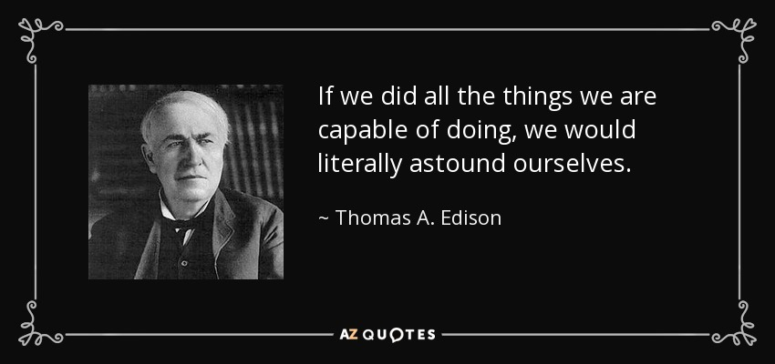
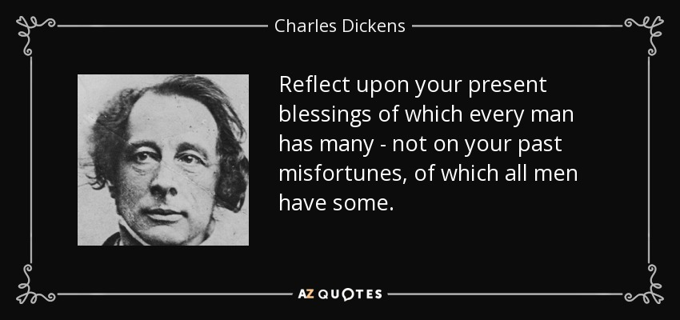
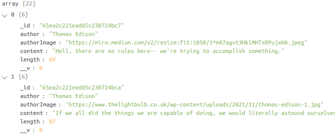
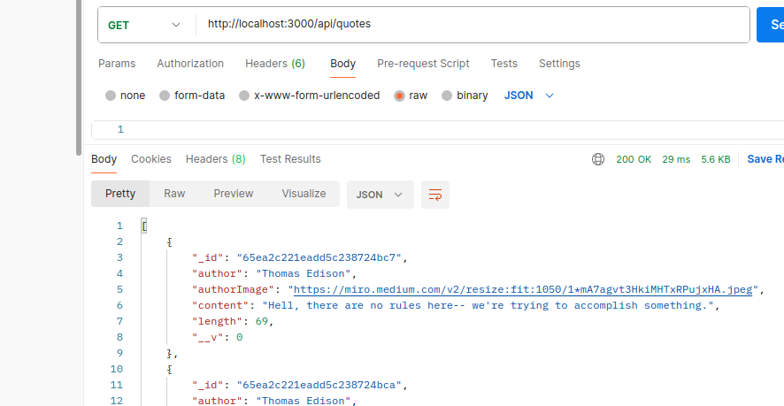
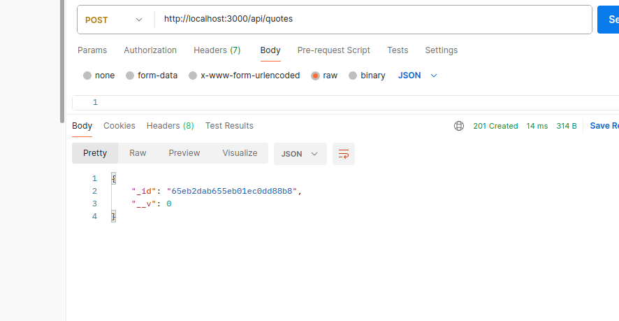
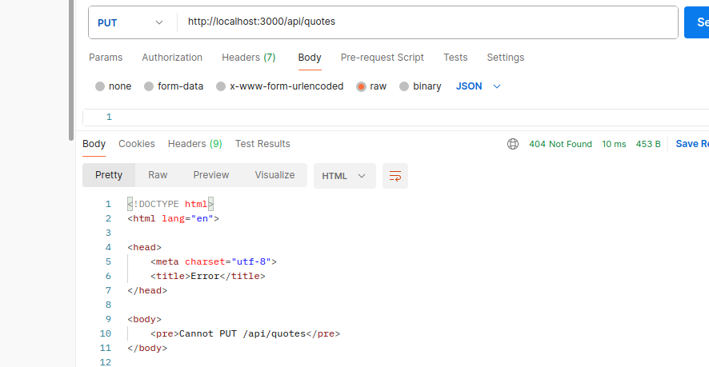

# Quotes API
This API is a collection of 20 beautiful quotes from Thomas Edison, and Charles Dickens. This API was made from Quotable, a free open source quotation API at  https://api.quotable.io/quotes/

The following information are listed on the API

Author's name

Author's image

Content

Tags

Length

Below is a Snippet of the JSON Format

How it works

The below link will take you to the array list of the Quotes.

http://localhost:3000/api/quotes

CRUD Functionality

To read (GET) all the quotes in the list:

Use the below endpoint with Postman. Make sure to have the GET setting selected.

To create (POST) a new quote:

Use the below endpoint with Postman. Make sure to switch to the POST setting, click on Body, and select raw and JSON.

To update (PUT) or delete (DELETE):

Use the same endpoint on Postman. Make sure to switch to the appropriate HTTP verb (i.e update or delete). Any sort of update or deletion will require the id of the quote that you are updating or deleting.

Resources

Postman
Node
Express
Morgan
CORS
Chalk
Mongoose
MongoDB
JSON
Node Fetch

